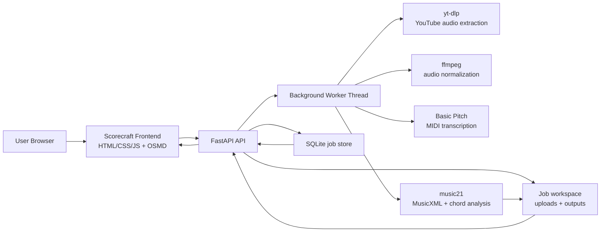

# Scorecraft Architecture

```mermaid
flowchart LR
  U["User Browser"] --> F["Scorecraft Frontend\nHTML/CSS/JS + OSMD"]
  F --> A["FastAPI API"]
  A --> Q["Background Worker Thread"]
  Q --> Y["yt-dlp\nYouTube audio extraction"]
  Q --> FF["ffmpeg\naudio normalization"]
  Q --> BP["Basic Pitch\nMIDI transcription"]
  Q --> M["music21\nMusicXML + chord analysis"]
  A --> DB["SQLite job store"]
  A --> FS["Job workspace\nuploads + outputs"]
  M --> FS
  DB --> A
  FS --> A
  A --> F
```

## Deployment
- GitHub Actions self-hosted runner
- Docker Compose on `/opt/protfolio/scorecraft`
- Nginx reverse proxy via `https://protfolio.store/scorecraft/`
